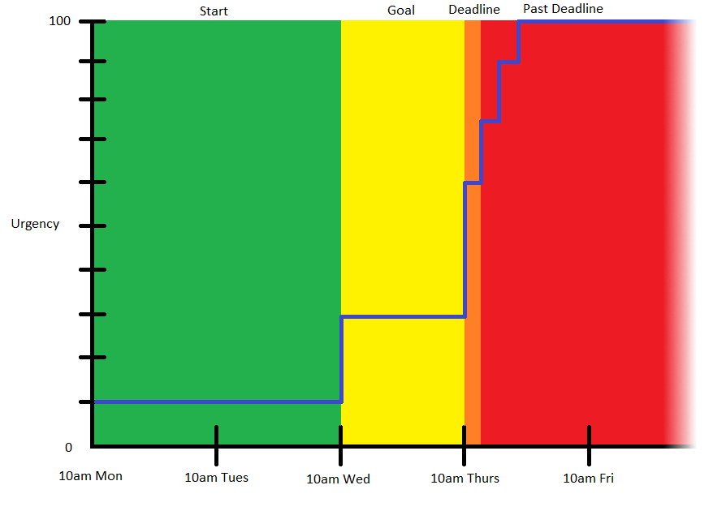

# Service Level Agreements #

## Overview ##
To help companies complete work in a timely manner, they often establish a `Service Level Agreement` (SLA). SLAs outline the severity and urgency of potential issues, who is responsible for fixing those issues, and the timeframe for completion. The source of a SLA can range from informal response-time promises to officially negotiated contracts. In Pega, SLA considerations can be applied to types of employee tasks. These tasks receive an `urgency value`. Values dynamically update based on SLA rules and deadlines, with the most urgent tasks appearing first in an employee's `User Portal`. Companies may also choose to automatically perform actions on tasks at designed time intervals.

## Why have a Service Level Agreement? ##
The heat has gone out in your apartment. It's snowing outside. Your energetic children are hollering that they're cold. Your wife looks at you with even colder disappointment. Who is supposed to fix the heat? You, the landlord, or the property management company? When should the heat be fixed? Today, tomorrow after the storm, next week, or whenever someone gets around to it? 

Things break. That's just a fact of life. Establishing a SLA beforehand can provide clarity and direction when an issue occurs in the future. In the apartment example, SLA information could come from your lease, from an informal gentalman's agreement following a casual conversation with the landlord, or be dictated by local laws. It's not uncommon for SLA information to come from a variety of sources.

The value and assurance of a SLA is applicable across industries. An online retailer needs assurance that the mission-critical database they are licensing won't go offline for too long. Too long of an outage means missed sales and lost revenue. A SLA could also be used internally. Timecards require timely manager approval. A small delay may have trivial consequences, but a large delay could mean employees can't pay their bills and lose their homes! It's also a great way to lose employees and destroy the business.

## SLAs in Pega ##
Work that needs to be done is captured through tasks in ticketing systems. With Pega, companies can factor their SLA considerations into the urgency of tasks. This helps ensure more-urgent tasks are clearly identified and completed sooner. Companies may choose what types of tasks deserve SLA logic. There are three components to this:
- Urgency Value
- Time Intervals
- Actions to Perform

### Urgency Value ###
Not everything is an emergency! The urgency of tasks should naturally vary. True urgency depends on factors like the severity of the issue, and the time remaining before a deadline. This is accommodated and quantified in Pega through a task's `urgency value`. Tasks in an employee's `User Portal` are ordered by their urgency values. Higher urgency tasks are listed first. A new task always starts with an urgency value of 10. This value can increase at chosen `time intervals` as the deadline approaches, up to a maximum urgency value of 100.

### Time Intervals ###
A company can set time intervals for each type of task. All tasks of a given type will have the same time intervals. This standardizes how long an employee has to complete different types of tasks. There are four configurable time intervals:
- **Start:** Begins when the task is created
- **Goal:** The interval when the task should ideally be completed 
- **Deadline:** The interval when the task must be completed
- **Past Deadline:** Repeats as many times as desired and serves as an additional opportunity to increase the urgency value or perform other actions

The beginning of the Goal and Deadline intervals are configured in Pega as the time that has passed since the Start interval began. The beginning of the Past Deadline interval is configured in Pega as the time that has passed since the Deadline interval began.

### Actions to Perform ###
Actions can be performed each time a task enters the next time interval. Companies can configure one or more of the following actions to automatically occur on a task:
- Increase the urgency value
- Notify the manager
- Reassign to another party
- Auto-approve 

## Timecard Example ##
A company leverages Pega's SLA feature for internal tasks. They configure these rules for timecard approvals:
- Start:
    - Begins when a timecard is submitted for approval 
    - Urgency starts with a default value of 10
- Goal:
    - Begins 48 hours after the Start interval 
    - Increase Urgency by 20
- Deadline:
    - Begins at 72 hours after the Start interval
    - Increase Urgency by 30
- Past Deadline
    - Occurs every hour after the Deadline interval
    - Repeats three times
    - Increase Urgency by 15 each time

If a timecard is submitted for approval at 10am Monday, the following occurs: 

Time Interval | Time Interval Begins | Actions to Perform | Urgency Value
---|---|---|---
Start | 10am Monday | - | 10
Goal | 10am Wednesday | Urgency +20 | 30
Deadline | 10am Thursday | Urgency +30 | 60
Past Deadline | 11am Thursday | Urgency +15 | 75
Past Deadline | 12pm Thursday | Urgency +15 | 90
Past Deadline | 1pm Thursday | Urgency +15 | 100

What happens if a manager goes on vacation? If timecards in this scenario require manual approval from the manager, these tasks risk reaching the Past Deadline interval. The company may want to configure additional actions if the task reaches later intervals. For example, the task could get assigned to the manager's manager when the Deadline is reached. Or, the timecard could auto-approve if it reaches the Past Deadline interval.
